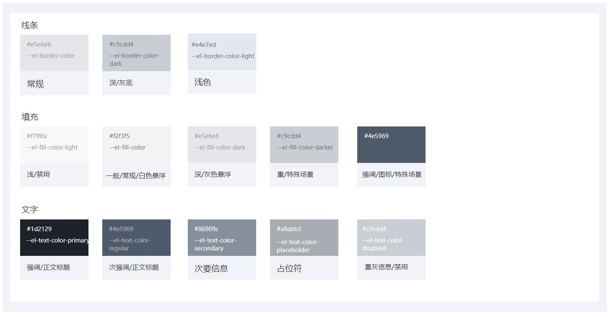

###  中性色

通过运用不同的中性色，来表现层次结构。





- 常用于文字、背景、图标、边框和分割线等元素。

::: tip

中性色非常重要，在页面中应用最多。由于是无彩色系，只要控制得当，可以大面积使用，不会增加界面的信息负担，反而有利于形成内容层次和区域划分，让界面更加有序，内容结构更加清晰，还不会影响界面风格。


当然中性色使用时，需要有比较明确的色彩对比关系，否则可能模糊一团，影响信息的可读性。

:::

### 背景色

背景色是用来设置图像的背景颜色，也用来设置文档、表格、图像等的背景颜色。用于不同的区域之间叠加需用不同的背景色区分，体现出层次感。
:::demo  

```html
<template>
  <div class="main">
    <div class="border-area demo-bg">
      页面背景色(--el-bg-color-page)
      </br>#F2F3F5
    </div>
    <div class="border-area demo-bg-light">
      页面背景色(--el-bg-color)
      </br>#FFFFFF
    </div>
  </div>
</template>
<style scoped>
.main {
  display: flex
}
.border-area {
  margin-right: 30px;
  width:340px;
  height: 150px;
  display:flex;
  align-items: center;
  justify-content: center;
  text-align: center;
  color: var(--el-text-color-regular);
  border-radius: 2px
}
.demo-bg {
  background: var(--el-bg-color-page)
}
.demo-bg-light {
  border: 1px solid var(--el-border-color);
  background: var(--el-bg-color)
}
</style>
```
:::

