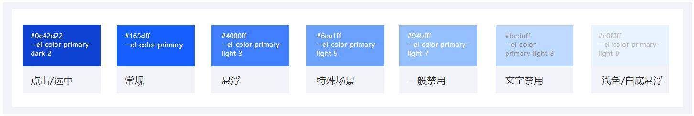

###  主色

主色是一个产品的代表颜色，一般与品牌色相关联。常用于主要按钮和文字、高亮提醒、空状态等

通常，一套产品只有一个品牌主色，是界面中出现最多的颜色，在需要用色强调而且没有其他要求时，一般都会选择主色，例如重点操作状态，tab的选中态，图表的颜色等

- 主题色是产品中最核心、最高频使用的颜色，它常用于强调信息、引导操作，并在很大程度上决定了产品整体的基调和风格

- 使用主色突出信息，引导操作，功能状态表达

- 用于文字按钮、链接、卡片底色或边框色
