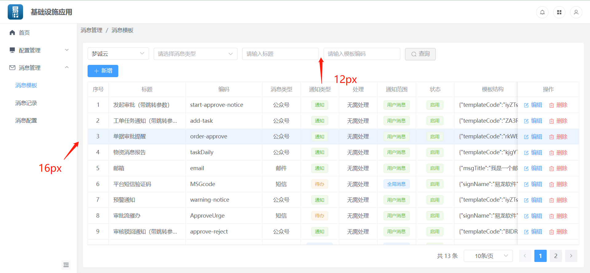

###  布局技术


前端开发中布局中推荐使用css的flex布局技术。如果对flex布局不了解,[参考此教程](http://www.ruanyifeng.com/blog/2015/07/flex-grammar.html)


### 布局组件

1.`element-plus`中提供了24栏布局方式布局组件,[用法参考](https://element-plus.org/zh-CN/component/layout.html)

2.`element-plus-extension`中提供了`flexbox`组件用于弹性布局,[用法参考](docs.html#/flexBox)

2.`element-plus-extension`中提供了`splitPanel`组件,可以手动拖动容器区域大小,[用法参考](docs.html#/splitPanel)


### 布局规则

1.确定是弹性布局还是流体布局。一般情况下，报表类模块使用流体布局，操作类模块使用弹性布局

2.确定元素块，并规划好布局位置以及尺寸，元素块需要用`panel`组件包裹

3.块之间应使用`margin`给块之间留出间距，使用`padding`留出内边距；块内部的元素也应该使用`margin`或`padding`留出间距

4.间距值使用系统提供的间距变量。规定模块最外层使用`--el-layout-gap-large`内边距，其余都使用`--el-layout-gap-base`，`--el-layout-gap-small`在少量情况下使用

```css
/* 变量名和值 */
body {
  --el-layout-gap-small: 8px;
  --el-layout-gap-base: 12px;
  --el-layout-gap-large: 16px;
}
```



4.尽量使用组件库中提供的组件来包裹元素，容器组件有：`toobar`、`panel`、`flexbox`、`splitPanel`

5.布局完成之后消除重复的间隔或边框